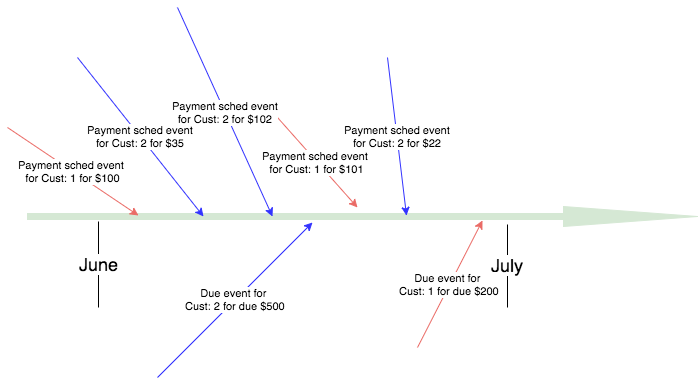

# Highly scalable, resilient real-time monitoring, complex event processing (CEP) or anomaly detector using Kafka Streams library

## 1. Introduction:

This application shows how to use Kafka stream library to build scalable and resilient real-time monitoring solution or CEP engine to detect anomalies. Features include:

1. The core logic is implemented in core java programming languages, let's call this compute layer
2. System can be scaled up by Kafka topic partition to accommodate high throughput of messages
3. The compute layer can be horizontally scaled up by simply adding more nodes and Kafka cluster would balance the load across all these available nodes. 
4. There is no need for a separate computer cluster (such as Apache Spark / Apache Flink etc). A simple horizontally scalable stateless compute nodes are managed by existing Kafka cluster &  Kafka stream library.  
5. Completely unit testable using embedded Kafka broker in developer machine
6. Refer to section 3.d to see other use cases that can be implemented using Kafka stream library.
7. This document has **five** main sections: (a) Introduction, (b) Problem definition, (b.1) how to run the reference application, (c) Kafka stream architecture key capabilites explained and (d) Reference section that list all the materials referenced for this work.  

## 2. Problem definition:

1. The problem is in Banking loan payment domain, where customer have taken a loan and they need to make monthly payment to repay the loan amount.
2. Assume there are millions of customers in the system and all these customer needs to make monthly payment to their account.
3. Each customer may have a different monthly due date depending on their monthly loan due date.
4. Each customer payment would appear as a [PaymentScheduleEvent](src/main/java/playground/kafka/streams/model/PaymentScheduleEvent.java) Event.
5. Customer can make more than one [PaymentScheduleEvent](src/main/java/playground/kafka/streams/model/PaymentScheduleEvent.java) per month.
6. Each monthly due for a customer would appear as a [PaymentDueEvent](src/main/java/playground/kafka/streams/model/PaymentDueEvent.java).
7. An arbitrarily chosen anomaly condition for this example is that, if the amount due is more than $150 for any customer at any point in time, then generate an anomaly.
8. Below diagram shows how various events appear across space and time for two customer accounts. **Red** events are for customer with account# 1 and **Blue** events are for customer with account# 2 and imagine there are millions of possible customer events in time-period such as due date. 
9. As one can imagine the events can appear at any point in time and can come in any order and there can be thousands of events at any point in time. The anomaly detector needs to group the similar event that belongs to a customer and apply appropriate logic on these grouped events to determine the impact of these events on a customer at a point in time in a streaming fashion.
10. The anomaly detector should generate anomaly on per event and per customer basis The anomaly condition is: **If any account that has more than $150 payment due then anomaly needs to be generated.** And anomaly should be re-calculated for the **only affected customer only** based on the arrival of a new event for that customer. Should not re-calculate for **any** other customers. This way solution is scalable, does not waste CPU cyly and is simple to reason about and maintain.

### 2.a. How to run the sample application

1. Start Kafka and zookeeper using confluent downloads, turn on the feature that allow **topic to be dynamically created** as the sample depends on that feature.
2. The best way to install it by taking it from confluent platform.
3. Install latest confluent version platform as of this writing 3.3.0) and by following instructions from http://docs.confluent.io/current/installation.html
4. Start the needed component by following instructions from http://docs.confluent.io/current/quickstart.html. Make sure Kafka is running on localhost:9092, if it is different port, change it in the Startup.java class.
5. cd /Users/iky215/software/confluent-3.3.0
6. ./bin/zookeeper-server-start ./etc/kafka/zookeeper.properties 
7. ./bin/kafka-server-start ./etc/kafka/server.properties 
9. Run Startup.java. This class will create two topics (schedule payment event & due event), send events, create stream that looks for the anomaly condition. The anomaly condition is: **If any account that has more than $150 payment due then anomaly needs to be generated** 
10. After running the application wait for 12 seconds, the log would show sending of all the events and two anomaly being generated. 
11. Refer to the next section in README to learn more about additional notes and about Kafka stream library. Other than that the code is well-documented and can be followed by starting from Startup.java.  
12. To run unit testing code, run [KafkaStreamTest](src/test/java/playground/kafka/streams/KafkaStreamTest.java).

## 3. Kafka streams architecture explained:

Below section explains the key capabilities of Kafka streams architecture.

### 3.a. How Kafka steam support building scalable system with scalable compute nodes but not needing a compute cluster

1. Solution can scale up by adding horizontal stateless compute nodes developed in java/spring/other-programming languages without needing any additional compute **cluster**
2. Kafka & its streaming library used in the compute layer would scale the overall solution up to the  number of available compute nodes. 
3. There is no need for another compute cluster such as Spark/Flink etc. Kafka cluster come with its own resource manager, load balancer, health monitors etc. All those components would be at play and manages the stateless compute layer.

### 3.b. How Kafka steam support building resilient system

1. The compute layer node uses Kafka stream library and it come with a transparent RocksDB store to store the local state, and these state is backed up by Kafka seamlessly in a Kafka compacted topic. 
2. Various aggregate results/state that are in the RocksDB (again transparently stored without using RocksDB API) and this state is automatically migrated over to another compute node by Kafka in case of compute node failure.
3. The event store can be queried back as needed.
4. Kafka also provides a REST API to query all the nodes in the compute layer. The host and port number of these nodes are exchanged automatically among the nodes by Kafka.

### 3.c. How to unit/integration test from a developer machine

1. The solution includes [KafkaStreamTest](src/test/java/playground/kafka/streams/KafkaStreamTest.java) which show-case how to create end to end test case that stands-up an embedded Kafka & zookeeper server.
2. kafka topics are created on the embedded Kafka broker and a stream topology is created that reads from these Kafka topics
3. Each test case setup and tears down the entire stack and is repeatable across each test case. The local state store is also removed after each test-case execution.
4. A [QueryableAnomalyPublisher](src/main/java/playground/kafka/streams/model/AnomalyPublisher.java) is provided, that helps to listen to the anomalies published by the stream engine from inside the junit. 

### 3.d. Other use cases that can be implemented using Kafka streams library 

- Helps to implement highly scalable anomaly detection use cases.
- Helps to implement Complex event processing engines.
- Helps to implement real-time feed for live dash-boards & charting.
- Helps to implement real-time monitoring solution.
- There is also an emerging KSQL, which is like a SQL language that can be used to implement the Anomalies/CEP logic and store the results in the state store instead of using the streaming api library directly and coding in java or other programming languages.
- The results of state store can be moved into scalable data-store such as Elastic/S3/HDFS/JDBC/REDIS/Cassandra/etc and can be populated using Kafka connect library.

### 3.e. Cons of using Kafka streams library 

- It should not be used if the data store needs to be stored permanently and if the data layer needs to be scale out independently of processing layer to satisfy other needs. In such case use Kafka connect to push the state into a scalable data layer.
- Solution is Kafka centric approach.
- Alternate solution are, implement it using Spark  / Flink or use CEP (Esper) solutions. In such case, a separate cluster needs to be maintained.

## 4. References:

Following are some of the key article referenced in preparation of this example project. These articles provide a great back-ground on streaming application approach as well. Take time and digest these concepts.

1. Turning database inside out by Klepmann [video](https://www.youtube.com/watch?v=fU9hR3kiOK0)
2. JKreps' questioning of lambda architecture [article](https://www.oreilly.com/ideas/questioning-the-lambda-architecture).
3. Confluent 6 series article on Kafka's role in data intensive application. The first of those six series can be found  [here](https://www.confluent.io/blog/data-dichotomy-rethinking-the-way-we-treat-data-and-services/) .  Follow the links at the end of the first article to find the rest of the 5 articles.
4. In stream processing, there are concept such as: Event-time, process-time, Ingestion-time, Water marks & late event binding. Here is a [google article1](https://www.oreilly.com/ideas/the-world-beyond-batch-streaming-101) and [article2](https://www.oreilly.com/ideas/the-world-beyond-batch-streaming-102) on this topic.
5. Kafka supports all the above semantic and is explained elegantly by introducing KTable. The details are available in the [article](https://www.confluent.io/blog/watermarks-tables-event-time-dataflow-model/).
6. This example uses the event-time instead of ingestion time or process time by using [EventTimeExtractor](src/main/java/playground/kafka/streams/model/EventTimeExtractor.java)
7. JKreps' explanation of key Kafka stream library details can be found in this [article](https://www.confluent.io/blog/introducing-kafka-streams-stream-processing-made-simple/)
8. KStream & KTable's inner, outer and left join concept are explained in detail in this [artcle](https://blog.codecentric.de/en/2017/02/crossing-streams-joins-apache-kafka/)
9. Interactive query in Kafka [article](https://www.confluent.io/blog/unifying-stream-processing-and-interactive-queries-in-apache-kafka/).
10. KSQL is another emerging approach rather than using streaming api directly to create the state store, the details can be found in this [article](https://www.confluent.io/blog/ksql-open-source-streaming-sql-for-apache-kafka/). 
11. Ideal ways to enrich KStream with KTable data can be found in this [article](https://stackoverflow.com/questions/41029748/ideal-way-to-enrich-a-kstream-with-lookup-data) 
12. How to apply tombstone in the state store to expire message is found in this [article](https://cwiki.apache.org/confluence/display/KAFKA/Kafka+Stream+Usage+Patterns).
13. To learn in depth Kafka-stream concepts, the best place is to follow confluent team's sample [project](https://github.com/confluentinc/examples/tree/3.3.0-post/kafka-streams) 

## 5.a. Additional Notes - 1.

Sometime Kafka need to be cleaned up to get to a clean state, perform these steps to ge to a clean state

- cd /tmp
- rm -rf zookeeper schema-registry-logs kafka-logs
- cd /Users/iky215/software/confluent-3.3.0
- rm -rf logs

## 5.b. Additional Notes - 2. Outer join sliding window explained:

Kafka allows to perform outer join across topics and apply sliding window to group events within a time-frame. For this example the sliding window size **does** not matter because events from both topics are stored in a local store (KTable) and are expired and controlled by the application specific code [PaymentDueAnomalyDetector](src/main/java/playground/kafka/streams/PaymentDueAnomalyDetector.java). The events are send via [EventPublisher](src/main/java/playground/kafka/streams/EventPublisher.java) and outer join and sliding window (5 seconds length) are configured in [PaymentAnomalyApp](src/main/java/playground/kafka/streams/PaymentAnomalyApp.java). As stated, for this application the sliding window size **does** not matter but the consequence of these settings is explained below.
 
1. [EventPublisher](src/main/java/playground/kafka/streams/EventPublisher.java) sends events to two topics (schedule and due events topics) and all events have the same key, which is **customer account number 1**
2. A Kafka stream **paymentEventsOuterJoinStream** is created inside [PaymentAnomalyApp](src/main/java/playground/kafka/streams/PaymentAnomalyApp.java) across these two topics. This stream has a sliding window across these two topics which is set to 5 seconds.
3. Send a payment event for $100.
4. Send another payment event for $101.
5. Send a due event of $200 after 1 second delay. 
6. All the above three events (Payment of $100 & $101) and due of $200 would appear together because of outer join of 5 seconds sliding window.
7. Make a 4 seconds delay and send another due event for $211. This will show that this event ($211) appears in the next sliding window stream. And customer payment event with $101 payment would repeatedly appear in this sliding window as well. This happens because 5 seconds sliding window is a continuously overlapping window and that makes the payment event with $101 payment to fall in two overlapping sliding windows.
8. The last event for due of $212, this will appear only by itself because this event is beyond the reach of (5 seconds sliding window's reach) of all the schedule payment events.
9. This example uses the event-time instead of ingestion time or process time by using [EventTimeExtractor](src/main/java/playground/kafka/streams/model/EventTimeExtractor.java), more on this later in reference section. Kafka supports all these 3 setting
